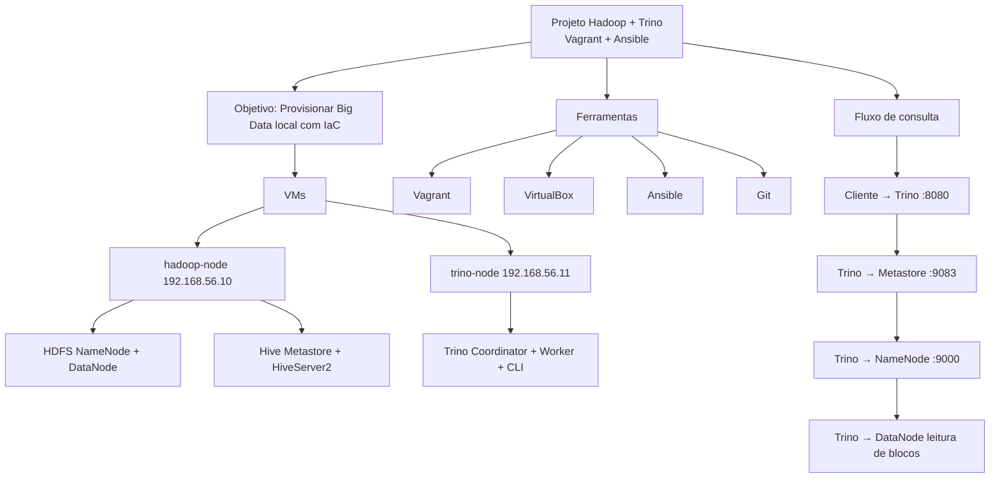
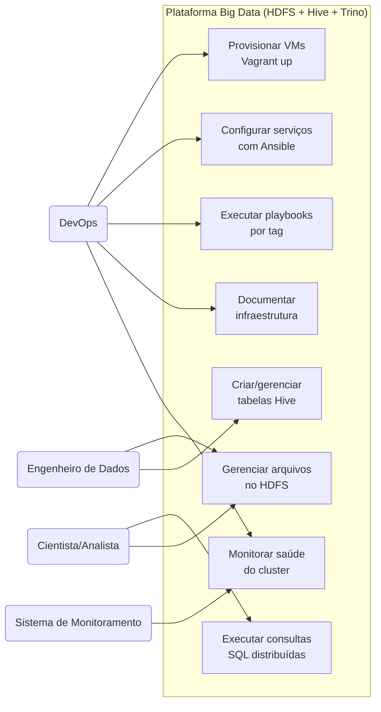
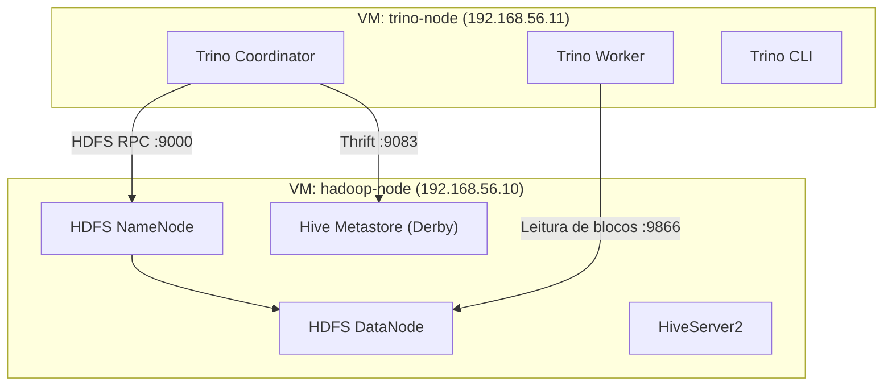
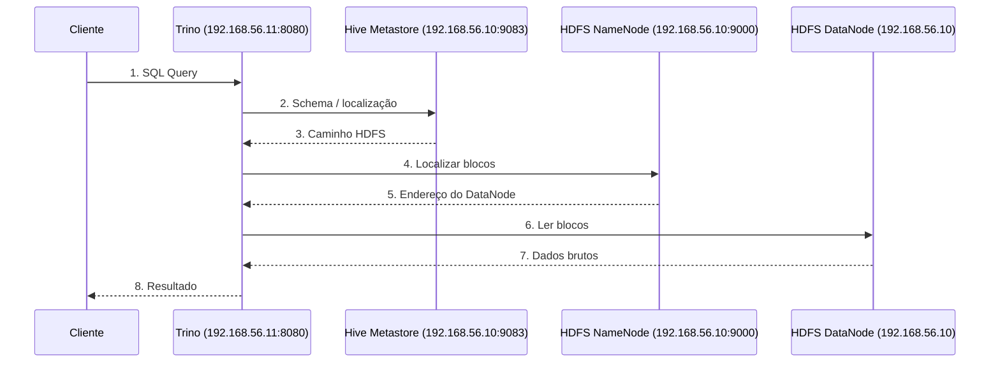
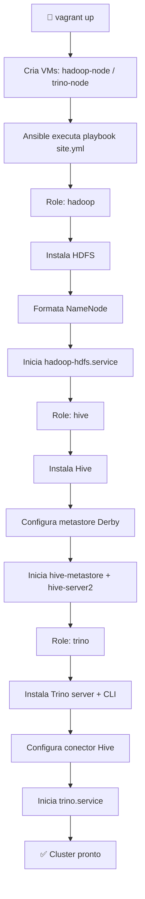

# 🚀 Vagrant Lab — Hadoop + Trino (Base Infrastructure)

## 📌 Visão Geral

Este projeto tem como objetivo provisionar uma infraestrutura local utilizando **Vagrant + VirtualBox**, servindo como base para um ambiente distribuído com Hadoop e Trino. A orquestração de software e a configuração do cluster são totalmente automatizadas via **Ansible**.

**Nesta etapa, o projeto entrega:**
* Provisionamento de máquinas virtuais com recursos isolados (CPU/RAM).
* Automação de Infraestrutura como Código (IaC).
* Configuração modular de serviços (Hadoop, Hive e Trino).
* Resolução de conectividade segura entre Windows (Host) e WSL (Ansible Control Node).

---

## 🧱 Arquitetura e Recursos

| VM          | Hostname    | IP Privado    | Função/Serviço         | Recursos         |
| ----------- | ----------- | ------------- | ---------------------- | ---------------- |
| hadoop-node | hadoop-node | 192.168.56.10 | Hadoop HDFS (Storage)  | 4GB RAM / 2 CPUs |
| trino-node  | trino-node  | 192.168.56.11 | Trino Engine (Compute) | 4GB RAM / 2 CPUs |

---

## ⚙️ Pré-requisitos

* **VirtualBox & Vagrant:** Instalados e executados no Windows.
* **WSL (Ubuntu/Linux):** Para execução do Ansible.
* **Ansible:** Instalado no ambiente WSL.

> ⚠️ **Nota:** O comando `vagrant up` deve ser executado no Windows (PowerShell/CMD). O script de automação `./setup.sh` deve ser executado dentro do WSL.

---

## 📁 Estrutura do Projeto

A organização segue as melhores práticas de modularização do Ansible (Roles):

```text
vagrant-ansible-hadoop-trino/
├── ansible/
│   ├── inventory/
│   │   └── hosts.ini          # Inventário com IPs e chaves dinâmicas
│   ├── roles/                 # Automação modularizada
│   │   ├── common/            # Configurações base (Java, utilitários)
│   │   ├── hadoop/            # Cluster HDFS (NameNode/DataNode)
│   │   ├── hive/              # Hive Metastore e Catálogos
│   │   └── trino/             # Motor de consulta distribuído
│   ├── ansible.cfg            # Otimizações da execução Ansible
│   └── playbook.yml           # Orquestrador principal
├── tests/                     # Scripts de validação de saúde do cluster
├── .gitignore                 # Exclusão de logs e chaves temporárias
├── Vagrantfile                # Definição da infraestrutura física
├── setup.sh                   # Script de boot e automação unificada
└── README.md                  # Documentação técnica
```

## 🚀 Como Iniciar

Siga estes passos na ordem exata para garantir que a comunicação entre o Windows (Host) e o Linux (WSL) funcione corretamente.

### 1. Provisionamento da Infraestrutura (Windows)
Abra o **PowerShell** ou **CMD** na pasta raiz do projeto e execute:
```bash
vagrant up
```

### 2. Configuração de Segurança SSH (WSL)
O Ansible exige que as chaves privadas tenham permissões restritas. Como os arquivos no Windows (/mnt/c/) possuem permissão total, precisamos movê-los para o sistema de arquivos nativo do Linux.

Abra seu terminal WSL na pasta do projeto e execute:
```bash
# Cria o diretório de chaves caso não exista
mkdir -p ~/.ssh/

# Copia as chaves geradas pelo Vagrant para a Home do Linux
cp .vagrant/machines/hadoop-node/virtualbox/private_key ~/.ssh/hadoop_vagrant_key
cp .vagrant/machines/trino-node/virtualbox/private_key ~/.ssh/trino_vagrant_key

# Define permissão de leitura apenas para o seu usuário (Obrigatório para SSH)
chmod 600 ~/.ssh/*_vagrant_key
```

### 3. Validação e Execução (WSL)
Ainda no terminal WSL, valide se o Ansible consegue "enxergar" as máquinas antes de rodar o setup:

Teste de Ping: *Caso uma das VMs falhe, basta reinicia-la e tentar novamente*
```bash
ansible all -m ping -i ansible/inventory/hosts.ini
```

Se ambos os nós retornarem "pong", a conexão está perfeita.

Executar Provisionamento:
```bash
./setup.sh
```

## Comandos Úteis
Executar Playbooks via TAGs
```bash
# Common
ansible-playbook -i ansible/inventory/hosts.ini ansible/playbook.yml --tags "common"

# Hadoop
ansible-playbook -i ansible/inventory/hosts.ini ansible/playbook.yml --tags "hadoop"

# Trino
ansible-playbook -i ansible/inventory/hosts.ini ansible/playbook.yml --tags "trino"
```

## Links Úteis
Download do Trino e Hive das versões utilizadas:

ansible/roles/hive/files/  
Rive: https://archive.apache.org/dist/hive/hive-3.1.3/apache-hive-3.1.3-bin.tar.gz

ansible/roles/trino/files/  
Trino: https://repo1.maven.org/maven2/io/trino/trino-server/442/trino-server-442.tar.gz

## Subir e Destruir ambiente via Vagrant
Requisitos:  
1 - Estar no terminal que o Vagrant está instalado.  
2 - Estar dentro da pasta onde o Vagrantfile está.  
```bash
# Provisionar VMs
vagrant up

# Atualizar VM após acrescimo de memória ou processador
vagrant reload hadoop-node

# Conectar via SSH se necessário
vagrant ssh hadoop-node

# Destruir ambiente
vagrant destroy -f
```
## Diagramas

### Mapa Mental


### Diagrama de Caso de Uso


### Diagrama de Implantação (Deployment)


### Diagrama de Sequência (Consulta SQL no Trino)


### Diagrama de Atividades (Pipeline Ansible de Provisionamento)
